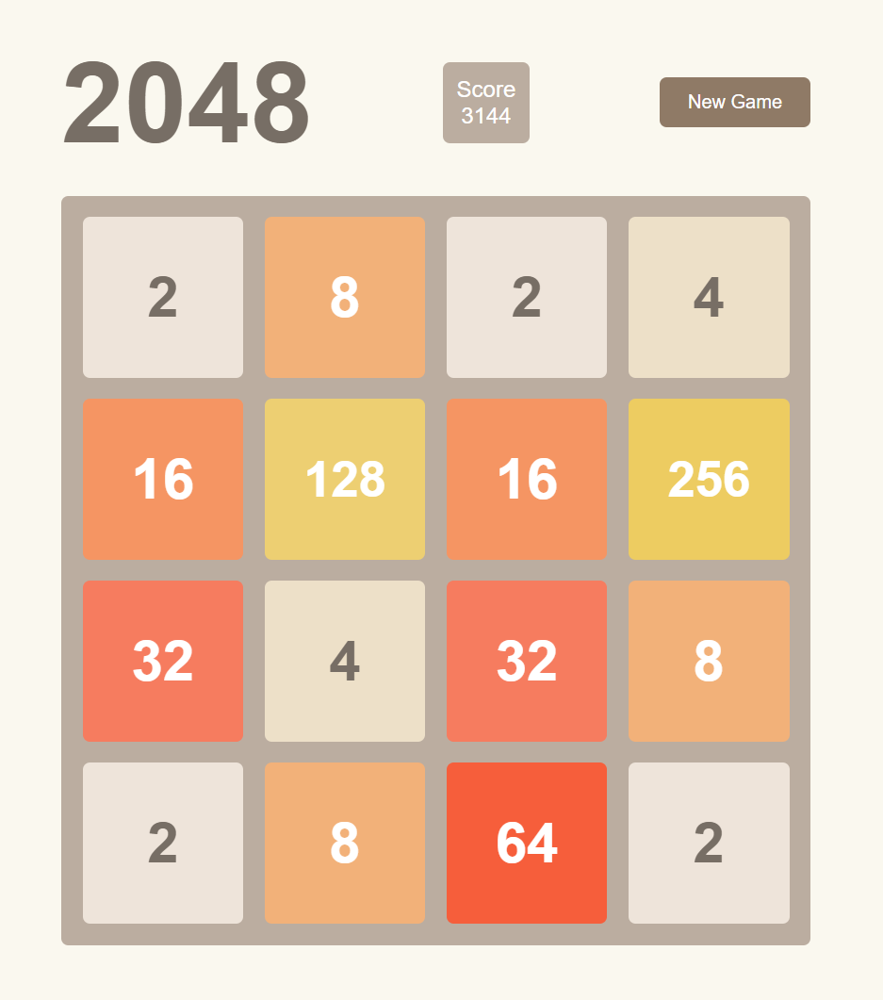

# 2048 Game | 2048 游戏

A smooth, responsive implementation of the classic 2048 game using pure HTML, CSS, and JavaScript.

经典2048游戏的流畅响应式实现，使用纯HTML、CSS和JavaScript开发。

[](https://github.com/ai-dengwsh/2048-game/stargazers)
[](https://github.com/ai-dengwsh/2048-game/network)
[](https://github.com/ai-dengwsh/2048-game/blob/master/LICENSE)

> Created by ai-dengwsh - Exploring the intersection of AI and Web Development
>
> 由 ai-dengwsh 创建 - 探索人工智能与网络开发的交汇处

[English](#english) | [中文](#chinese)

## Preview | 预览



## English

### Features

- Smooth animations and transitions
- Responsive design for all devices
- Keyboard arrow keys support
- Score tracking
- New game functionality
- Win/lose conditions

### How to Play

1. Use arrow keys (↑ ↓ ← →) to move tiles
2. When two tiles with the same number collide, they merge into one
3. After each move, a new tile appears (2 or 4)
4. Try to create a tile with the number 2048!

### Installation

1. Clone the repository:
```bash
git clone https://github.com/ai-dengwsh/2048-game.git
```

2. Open `index.html` in your web browser

### Technologies Used

- HTML5
- CSS3
- JavaScript (ES6+)

### Project Structure

```
2048/
│
├── index.html      # Game HTML structure
├── styles.css      # Game styling
├── game.js         # Game logic
└── README.md       # Documentation
```

## Chinese | 中文

### 特性

- 流畅的动画和过渡效果
- 适配所有设备的响应式设计
- 支持键盘方向键操作
- 分数追踪
- 新游戏功能
- 胜利/失败判定

### 游戏玩法

1. 使用方向键（↑ ↓ ← →）移动方块
2. 相同数字的方块相撞时会合并
3. 每次移动后会出现一个新的方块（2或4）
4. 尝试创建一个数字为2048的方块！

### 安装方法

1. 克隆仓库：
```bash
git clone https://github.com/ai-dengwsh/2048-game.git
```

2. 在浏览器中打开 `index.html`

### 使用的技术

- HTML5
- CSS3
- JavaScript (ES6+)

### 项目结构

```
2048/
│
├── index.html      # 游戏HTML结构
├── styles.css      # 游戏样式
├── game.js         # 游戏逻辑
└── README.md       # 文档说明
```

## License | 许可证

MIT License | MIT 许可证

## Contributing | 贡献

Feel free to submit issues and enhancement requests!

欢迎提交问题和改进建议！

## Credits | 致谢

Original 2048 game created by Gabriele Cirulli.

原版2048游戏由Gabriele Cirulli创建。
